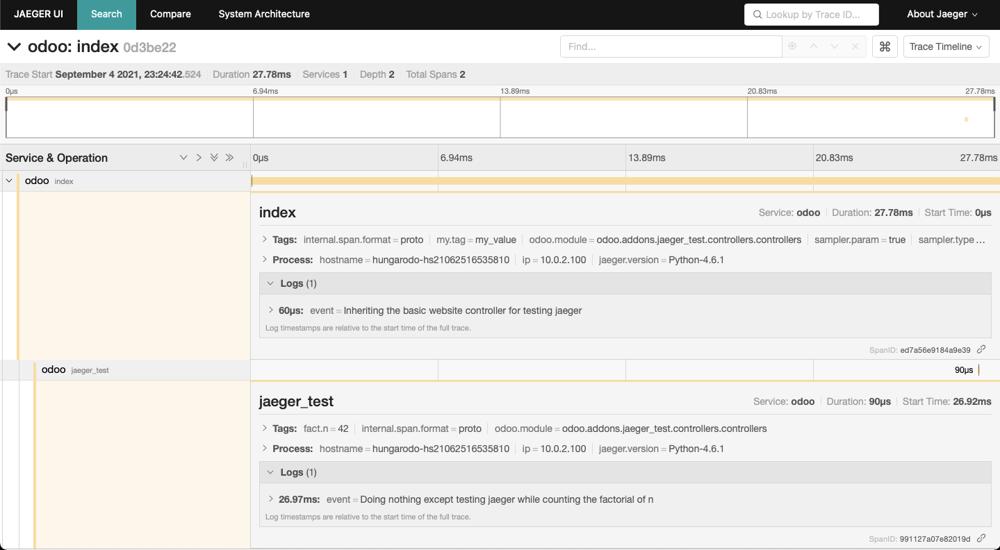

==============
 Jaeger Client
==============

Summary
=======

This module when installed, initializes the global opentracing.tracer object
for `Jaeger <https://www.jaegertracing.io>`_,
with configuration parameters loaded from file ~/.config/jaeger.yaml. If no config file
exists the init function poplutes it with default values.

Prerequisits
============

* jaeger_client and pyyaml python modules are installed
* jaeger agent is up and running beside your odoo

Usage
=====

.. highlight:: python

To instrument your apps, you can use a decorator provided by the module, like this::

   # -*- coding: utf-8 -*-
   from odoo import http
   from odoo.addons.jaeger_tracer import jaeger
   from odoo.addons.website.controllers.main import Website

   class Website(Website):
       n = 42

       @jaeger.span(tags={'my.tag': 'my_value', 'fact.n': n})
       def jaeger_test(self, n):
           fact = 1
           for i in range(1, n+1):
               fact = fact * i
           return fact

       @jaeger.span
       @http.route('/', type='http', auth="public", website=True, sitemap=True)
       def index(self, **kw):
           '''Inheriting the basic website controller for testing jaeger'''

           res = super(Website, self).index(**kw)
           self.jaeger_test(self.n)
           return res

Check out the official documentation for more:

* `Opentracing tutorial <https://github.com/yurishkuro/opentracing-tutorial/tree/master/python>`_
* `Python Jaeger Client documentation <https://github.com/jaegertracing/jaeger-client-python>`_.

Known Issues
============

* fails reporting spans in multiprocessing mode

Authors
=======

* János Gerzson (@grzs)
